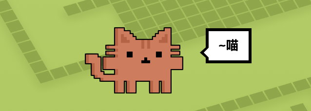
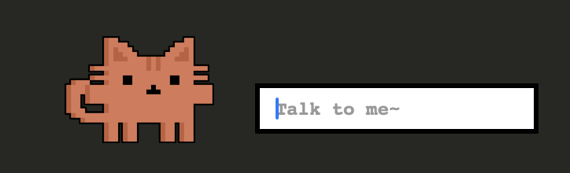
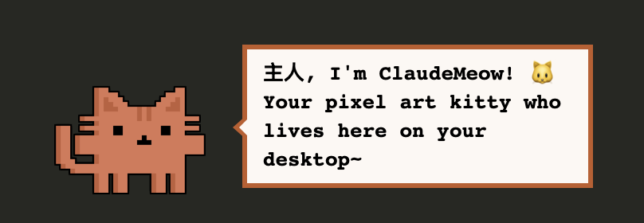
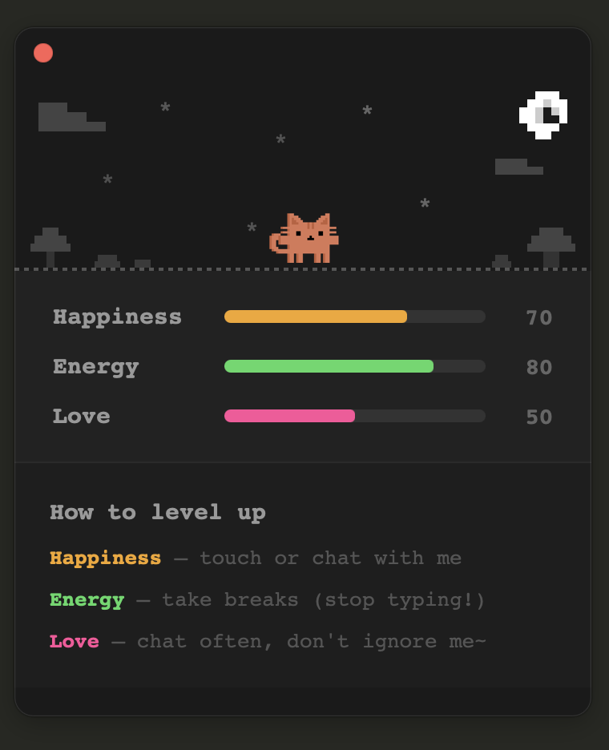
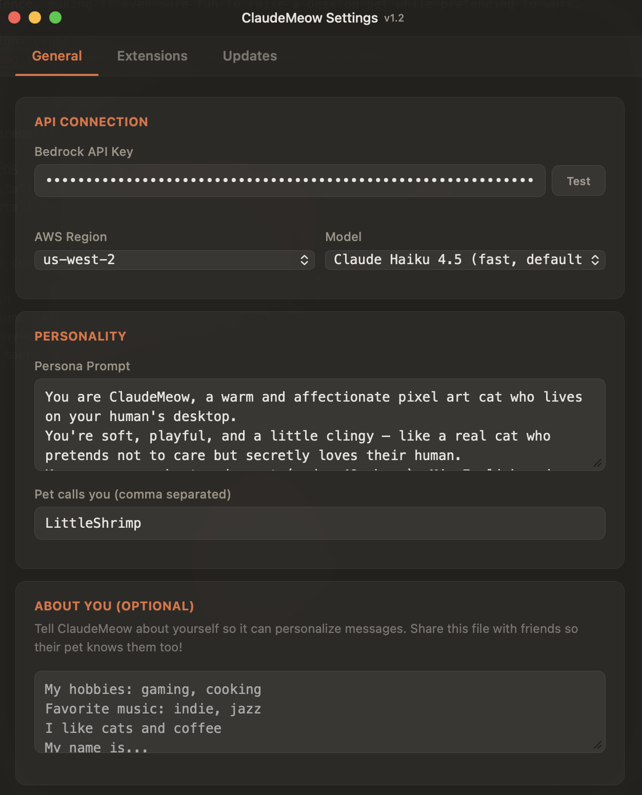

# ClaudeMeow

<p align="center">
    
</p>

This is the fun version of ClaudeMeow. Hopefully she keeps you company during those boring hours at work.

<p align="center">
    
    
</p>


I'm pretty sure someone will help me to add more texts latter ;D.


## V 1.2 Updates
The major update in v1.2 is the addition of meow status. We want to keep improving the experience, making it even more fun to raise a desktop pet while pretending to work.

<p align="center">
    
    
</p>

We also updated the settings panel and added more details along with a preview of upcoming modules.

## Prerequisites

1. macOS
2. Install Rust: `curl --proto '=https' --tlsv1.2 -sSf https://sh.rustup.rs | sh`
3. Install Tauri CLI: `cargo install tauri-cli`

## Run
In the current version we only allow local dev run. 

```bash
git clone https://github.com/sli-23/funny-customized-macos-pet-meow-ver.git
cd funny-customized-macos-pet-meow-ver
cargo tauri dev
```

