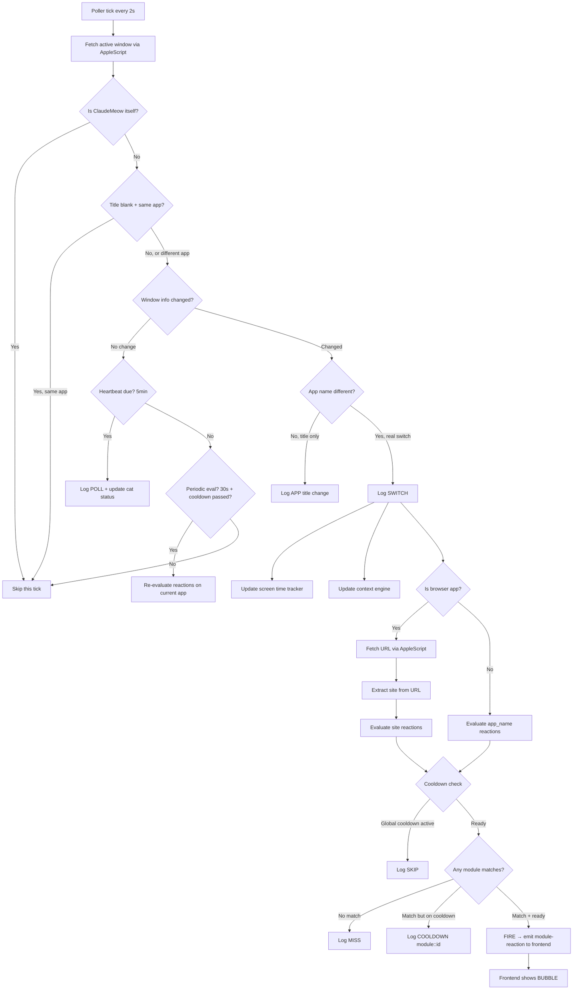
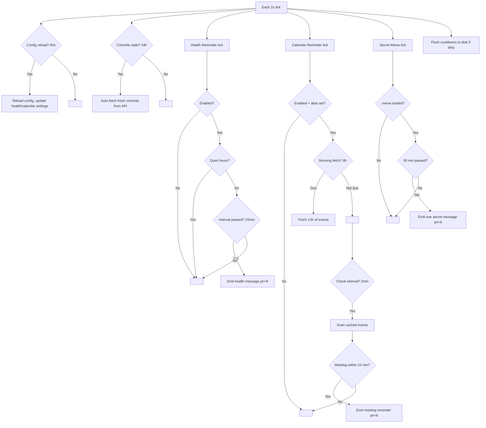
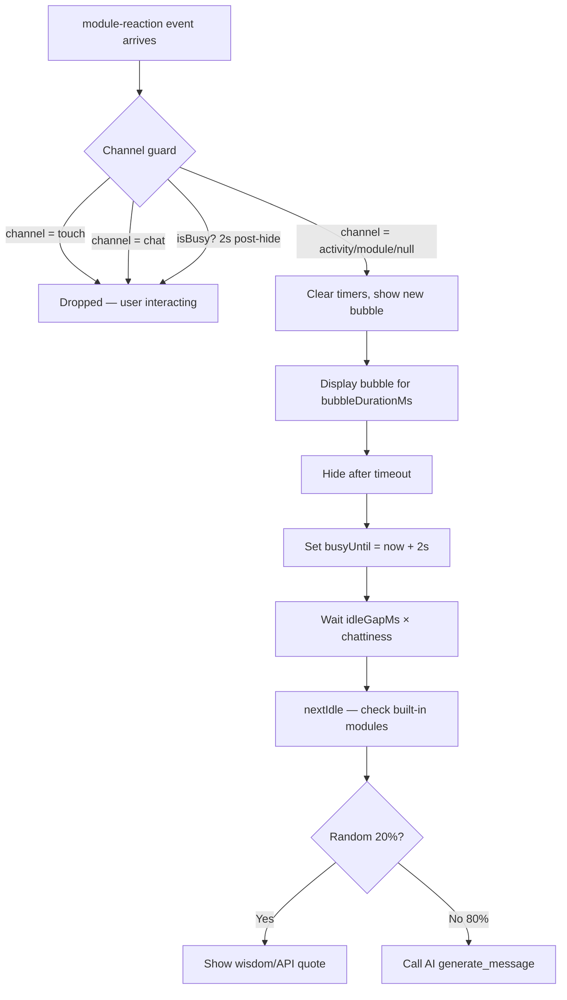
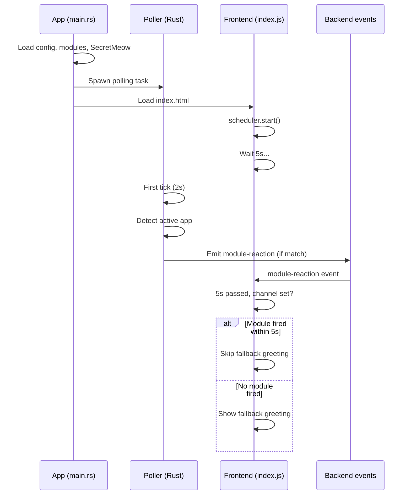
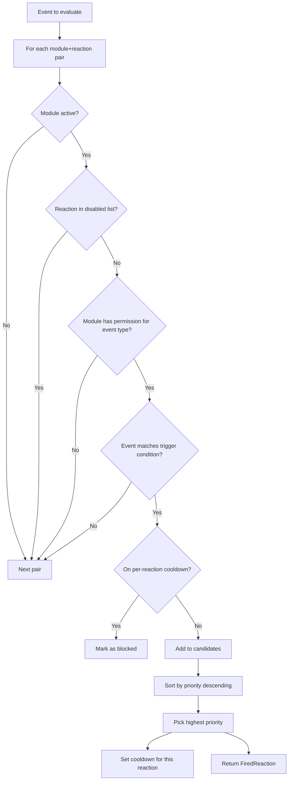

# Poller Workflow

The poller is the core engine that runs every 2 seconds, detects what you're doing, and triggers reactions.

## Main Loop

## Subsystems (also tick each cycle)

## Frontend Bubble Priority

## Startup Sequence

## Reaction Evaluation

